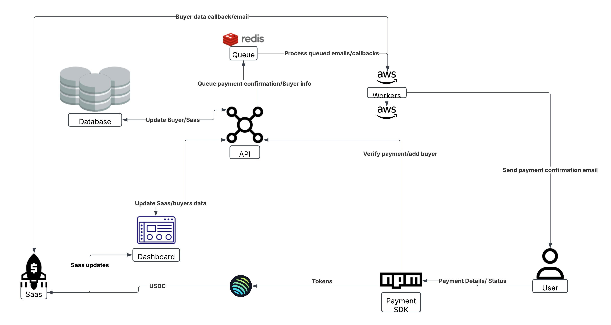

- [https://station.jup.ag/docs/swap-api/payments-through-swap](payment through swap)
- [https://station.jup.ag/docs/swap-api/send-swap-transaction#prepare-transaction](swap txn)
- [https://explorer.solana.com/tx/yioFzcpVaR1gf2MfWyGBtWKv9qzhAfzWeM5bDeNWLA7joD2ce78TXSYfw1oYuEUJfjQy8Lkkv5aRRbmGzd7Rbyp](test txn)
- [https://console.upstash.com/redis/](redis)


```npm run workers
"worker:email": "ts-node app/workers/emailWorker.ts",
"worker:callback": "ts-node app/workers/callBackWorker.ts",
"workers": "concurrently \"npm run worker:email\" \"npm run worker:callback\""
```
    npm i concurrently

workers repo
https://github.com/NIXBLACK11/nix-payment-gateway-workers

- formatting
npm run lint
npm run format

- publish sdk
rm -rf dist
npm run build
npm publish --access public